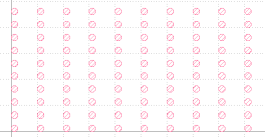
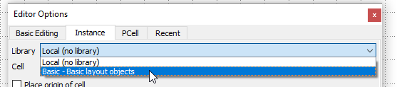

# Klayout Tutorial

<i>By Eric (Mita lab) - Version 210723 - Done with Klayout Version 0.27.2</i>

Klayout is a free **GDS** and OASIS file editor.

This document is an tutorial for **beginners**. Check the documentation at Klayout homepage for more details (https://www.klayout.de/).

Here I show how to create GDS files with the **GUI** (Graphical User Interface). It's also possible to do it using python or ruby macro. This will be the subject of another tutorial (under construction).

## Installation

* Installation is straightforward. Go to KLayout homepage (https://www.klayout.de/), download the version corresponding to your system and install it.

* Open KLayout **editor** (<u>not viewer</u>).

* The first time it opens, a Tip window appears. **Check** the *Don't show this windows again* checkbox and click **Yes**.

* Click **File → Setup** to open the *Setup* window.

  * In **Application → Editing Mode**, check **Use editing mode by default** checkbox and click **OK**. Thanks to this, KLayout will always open in Editor mode by default.

    

  * It can be convenient to see the axis, so let's also set **Display → Background → Axis → Lines**

## Creating a Layout and a Layer

* Create a new layout: **File → New Layout**

  

* Set the following parameters and click **OK**:

  

* Create a layer: **Edit → Layer → New Layer**:

  

* Click **OK** in the next window.

## Drawing a square

* Let's draw a box in a new cell. **Right click** in the Cells field and click **New Cell**:

  

* Enter square_0.5um for the Cell name and click OK:

  

* Click on the **Layer 1/0**:

  

* Click on the **Box** icon:

  

*  The *Editor Options* window may appear now. If not, open it: **Edit → Editor Option (or F3)**. The snapping behavior seems different depending on the versions, so let's set it now. In the *Basic Editing* tab, set *Grid* to **Other grid** and write **0.1** in the text field. Then the cursor will snap every 0.1um. Also, check the *Snap to other object* checkbox:

  

* Let's draw a 0.5um size square. There are two ways to do this:

  * First method: draw directly the square at its exact position and size.

    * In the **canvas** (the central panel), move the mouse pointer close to the origin (0, 0) until it snaps to the origin, then click once.
    * Move close to (0.5, 0.5) until it snaps to this point, then click again. You can **zoom in an out using the mouse wheel**, and you can see the **coordinates of the pointer** at the bottom right of the main window:

    

    * Congratulation, you have created your first box!

    * But you can already delete it by pressing **CTRL+Z** (shortcut for **Undo**) so you can try the second method to draw a square.

  * Second method: draw rapidly a box and set the position and size after.

    * Click anywhere in the canvas, move the mouse pointer somewhere else and click again.
    * Click the **Select** icon:

    

    * Double click on the square. The *Object Properties* window opens. Set the *Lower left* and *Upper right* coordinates as follow and click **OK**:

    

    * Personally I tend to use this second method, because snapping behavior used to be unstable, but it seems to have improved in the latest versions. Anyway, you can chose your favorite method.

## Create an array of squares

* Arrays of squares or circles are very popular among Takeda Clean Room users, so let's do this.

* You could copy and paste the square, but this is not the right method. The right method is to create **instances** of the square cell. In this case, if you change the  square size or position or if you do anything in the square cell, it will be reflected in all its instances.

* Create a new cell and call it **square_0.5um_array** with a *Window size* of 10um:

  

* Click on the *Instance* icon:

  

* In the *Editor Options* windows, *Instance* tab, check that the *Library* is set to **Local** and start to write square_0.5um in the *Cell* field. It will show a list of cell names. Select the **square_5um** cell. Then check the *Array Instance* checkbox and fill out the fields as follow:

  

* Then click on the origin or the canvas, close the *Editor Options* window and press **ESC** button. You have now an array of **10x10 squares** with a pitch of 2um in the x direction and a pitch of 1um in the y direction.

* Now you can see that the *square_0.5um* cell has disappeared from the *Cells* list at the left side. This is because this cell is now a subcell of the *square_0.5um_array* cell, so it was placed "inside" it. If you click on the triangle at the left side of the *square_0.5um_array* cell, it will open the hierarchy tree and you can see the square_0.5um cell again:

  

* The cell that appears in **bold** characters is the one displayed in the canvas. If you want to display another cell, you have to click it with the mouse center button. Try a center click on square_0.5um cell. The square should appear. Center click back to the square_0.5um_array cell. Before the squares were not filled with the layer1 stipple[^1]. Now they are. It seems that Klayout has automatically moved to the second hierarchy level. The hierarchy level is set here:

  

[^1]:  the stipple is the pattern and color which the shapes are filled with for a given layer

* The **hierarchy levels** represent how deep we are in the Cell structure:
  * Level 0: display the bounding box of the cell.
  * Level 1: display the shapes in the cell. The shapes can be of 5 sorts: **Polygon**, **Box**, **Text**, **Path** and **Instance**. In the square_0.5um_array cell, we only have instances of the square_0.5um cell, so all we can see is the bounding box of those cells.
  * Level 2: display what is inside of the first level instances. So we can see the square inside the square_0.5um cell.
  * Level 3: display what is inside of the second level instances. If there were some instances of other cells in the square_0.5um cell, we would see the contents, but this is not the case now so the display doesn't change between level 2 and level 3.
  * Level n: display what is inside of the n level instances.

* If you want to change the array properties, you need to do it from the level 1. Let's try:
  * Set level 2  and click on a square. The *Box Properties* window opens. Change the *Upper right* x value to **1** and click **OK**. This has changed the content of the square_0.5um cell which is reflected in all the instances. This is the power of using instances.
  * **CTRL+Z** to change back to square shape.
  * Now set level 1 and click on a square (which is actually the bounding box of the square_0.5um cell, not the square itself). The *Instance Properties* window opens. Here you can change the array's properties, like number of rows or columns, pitch, but also position, rotation, scale, etc...
  * Close the *Instance Properties* window.

## Create an array of circles

The circle is not available as a basic shape, so it's a bit more tricky to create. We will see how to do this in this chapter.

We could transform directly our square into a circle, but let's suppose that we want to keep the square array and create the same array of circles. Then we need to copy and paste the array or squares:

* Right click on the square_0.5um_array and click on **Copy**. The copy Cell Options window appears. Keep **Deep Copy** selected in order to copy also the subcells, and click OK.

  

* Right click in the *Cells* field and click **Paste**. A copy appear, automatically renamed to square_0.5um_array$1. Right click on it, click **Rename Cell**, and set circle_0.5um_array as the new name.

* Rename its subcell from square_0.5um$1 to circle_0.5um.

* Check that circle_0.5um cell is selected (appears in **bold** characters) and click on the square in the canvas.

* **Edit → Selection → Round Corner**: a dialog box appear. Set **0.5um** for the **Outer corner radius** and click **OK**:

  

* The square is transformed into a circle, or more exactly a polygon with 64 edges and this transformation is reflected in all the instances of the circle_0.5um so the circle_0.5um_array cell is now made of circles.

  

  

This was kind of a tricky way to do a circle: rounding a square corners. There is a more "proper" way to do it, by using the **PCells** (Parametrized Cells) available in the **library**. However, circles made from PCells are a bit different, as they are something between Cells and shapes and behave differently from polygons in certain occasions. Let's do circle by using PCells.

## Using PCells

* Select the circle in *circle_0.5um* cell and press **Delete** button to delete it.

* Click on **Instance** icon

  

* In the Editor Option window, select the **Basic - Basic layout objects** library

  

* In the Cell field, write "**CIRCLE**"

* Go to the PCell tab and  Select layer 2, set the radius to 5um and leave the number of points to 64, then close the Editor Option window

  * Click on **Instance** icon

    

  * In the Editor Option window, select the **Basic - Basic layout objects** library. In the Cell field, write "**CIRCLE**" and uncheck the Array Instance check box in order to draw only one circle.

    

  * Go to the **PCell** tab, select **layer 1**, set the radius to **0.25um** and leave the number of points to **64**, then close the *Editor Option* window

    

  * (Try to) Click at coordinate (0.25, 0.25) in the canvas to put the circle PCell center here. Actually it's not possible because of the snapping setting every 0.1um. So let just click anywhere.

  * We could put other instances of this PCell by clicking again somewhere else, but we need only one circle so let's press press **ESC**.

  * Now we see the bounding box of the circle PCell. Double click on it to open the *Instance Properties* window and set the position of the cell origin to (0.25, 0.25) in the Geometry tab and click **OK**:

    

  * If we want to see the circle itself, we need to set the hierarchy level to 2 in the circle_0.5um cell or look directly in the circle PCell by center click on Basic.CIRCLE(l=1/0,r=0.5,n=64) in the Cells field:

    

This method, using PCells may seem more complicated, but it is convenient if we need to create more complex shapes like ARC, DONUT, etc.

## Boolean operations

There are several ways to do boolean operations like subtraction, merging, etc...

### Direct shape subtraction with erase

* Let's do this on the square first. Go to the square_0.5um cell.

* Click the arrow at the right side of the **Add icon** and select **Erase**

  

* Click the Box icon and draw a square inside the square 

  

* The new inner square is subtracted from the initial square and you obtain a shape like this:

  

* You can play with other options like Merge, Mask and Diff in order to see what it does. Then go back the Add option, and to the square shape by pressing CRTL+Z few times.

* Now let's try to do it on the PCell. Move to the Basic.CIRCLE cell, select Erase option, and try to draw a box inside the circle. You get an error message:

  

* OK, let's try the same from the circle_0.5um cell. You don't get any error message, but nothing happens. **Actually this works only on "regular" shapes, like Polygons, Boxes or Paths of the same layer.**

* So if you want to do it the PCell, you need to convert it to polygons: in the circle_0.5um cell, click on the circle to select the circle PCell and do **Edit → Selection → Convert to static cell**. Now if you click again on the circle, you see that it became a polygon made of 64 points. You can see the points by double clicking on the circle.

* Now the subtraction is possible: Select **Erase** option and draw a box inside the circle. Oops, it doesn't work! This is because this is not the circle itself, but an instance of the circle. Go to the *CIRCLE* cell and try again. Now it works:

  

* Because of the snapping setting, it was not possible to draw a square of any size into the circle. In order to solve this problem, you can either change the snapping setting or use the second method for boolean operation described in the next paragraph.

### Shape subtraction using menu "Other from first"

Let's say that we need to substract a square or size 0.3um to the circle.

* Select **Add** icon
* Draw a Box of arbitrary size 
* Click **Select** icon and double click this new box
* Set the proper size in the Box Properties and click OK

* Click on the circle, press the Shift key and click on the box to select both together.
* **Edit → Selection → Subtraction - Others From First**
* Subtraction is done. Off course there are plenty of other possibilities like **Intersection** and **Separate**.
* This method can be used with multiple shapes and with different layers. Let's create a Layer 2 in order to illustrate.

### Work with multiple layers

Many process need several layers, one for insulator, one for etching, one for metal, etc... Let's see how to work with multiple layers.

* **Edit → Layer → New Layer → Enter 2 in the Layer field → OK**

* Click on the Layer 2 in the Layers field.

* Let's create some shapes in the circle. For instance as bellow.

  *(I have set the grid snapping to 0.025 before drawing the shapes, used Box+Round corners with 32 points for the circle, and polygons for the crosses. When drawing a polygon, you need to double click in order to finish. You can press Esc button anytime in order to cancel the drawing.)*

  

* Now select all the shapes (using Shift key), starting with the outer circle in layer 1.

  

* **Edit → Selection → Subtraction - Others From First**

* Subtraction is done. Difference with previous example is that the shapes in layer 2 are still here. 

* Double click on layer 2 in order to hide it. Now you see the layer 1 only and the result of subtraction is well visible.

  

* Of course if you go back to circle_0.5um_array, you can see that all those changes are well reflected in each cell of the array.

* So this method works with shapes of different layers but still doesn't work with Cells or PCells. In the next paragraph, I present a third method that works with Cells and PCells too.

### Boolean operations on layers

* Select the TOP cell and create instances of square_0.5um_array and circle_0.5um_array. Notice that the Hierarchy has changed in the Cells field. Now all the other cells are in the TOP cell.

  

* Let's suppose that we need to do a "black/white inversion" of the top layer.

* Create a layer 255 that will be used for the inversion.

* Select this layer and draw a square around the arrays. You get something like this:

  

* If we do the  boolean operation now, it will work fine, but it will change the subcells too. If will become more complicated to modify the design later. So I recommend to make a copy of the top cell and flatten it before inversion. **Flatten** means that all the shapes are moved to level 1 and the subcells disappear.

* Make a shallow copy of TOP cell and call the copy TOP_INV. **Shallow** means that the subcells are not copied, so any change in the subcells will be reflected both in the TOP cell and in the TOP_INV. We don't want this but we don't care because we are going to flatten the TOP_INV cell anyway, so it will not be related to any subcell anymore.

* Flatten the TOP_INV cell:

  * **Caution!** You need to go back to **<u>level 1</u>**, so in the next step, you will select the most high level subcells
  * Select everything in the TOP_INV cell (with the mouse or by **Edit → Select → Select All**)
  * **Edit → Selection → Flatten Instances → All hierarchy levels → OK**

* Next do **Edit → Layer → Boolean Operations** to open the *Boolean Operation Setup* window.

* Set Source A to 255, Source B to 1, Mode to Difference (A NOT B), Result to layer 1 and Hierarchy to Flat, then press OK

  

* Click Yes in the Tip window.

* The Inversion is done (only for layer 1 because this is the layer we have selected in the setup window).

  

* If you need to modify the design later, you can do it in the TOP cell (and its subcells), then copy and invert again.

## Non-orthogonal arrays

Up to now, we have done orthogonal (or rectangular) arrays. It's possible to do non-orthogonal arrays easily with KLayout but this is not the recommended way as it will not be recognized by the conversion software of some machines. Let's draw an hexagonal array as an example. The dimensions are as follow:

Here we will set dx=1um.

### Easy way (not recommended)

* Let's create a new cell that we will call hex_array.

* Click the Instance icon, set Library to Local, Cell to circle_0.5um, and check the Array Instance checkbox. Fix the Row step vector to (0.5, sqrt(3)/2) and Column step to (1, 0). sqrt(3)/2 is automatically calculated.

  

* The result is an hexagonal array like bellow:

  

## Recommended method

In this method, we have to include intermediate steps. It's a bit more time consuming but it works with every machines.

* Create a cell named circle_0.5um_lines.

* In this cell create two lines of circles.

  * First line:

    

  * Second line:

    

  * Result:

    

* Create a cell named hex_array_2

* In this cell, create a column of 5 cells circle_0.5um_lines

  

* The result is a nice hexagonal array that can be converted by all lithography machines in Takeda Clean Room (and that looks better than the first one which was slanted):

  

## Text

In this paragraph, we are going to write some text by different methods.

### Writing text with the Text icon

* Still in the cell hex_array_2, click on the Text icon:

  

* Enter 0.5um in the Text field and put the text bellow the array in the canvas

  

* This text is only for annotating your work, it is not part of the design. If you want the text to be part of the design, you need to use PCells (again).

### Writing text with TEXT library

* Let's delete the previous annotation. Click on the text handle (at the bottom left of the text) to select it and press Delete button.

* Click the Instance icon, set Library to Basic, Cell to TEXT and uncheck the Array Instance.

* Go to the PCell tab, write 0.5um in the Text field, select Layer 1 and click bellow the array to put the text:

  

* This text is treated as part of the design, and will appear on your device. However the font includes some slanted lines. Sometimes you don't want this. In particular the F5112 electron beam machine cannot be used in the fast "On the fly" mode if there are slanted lines. So it would be great if the text was done only with rectangular shapes. This is possible! You can use your own text and how to do this is explained in the next paragraph.

### Writing text with your own font

